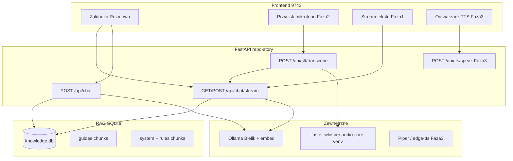
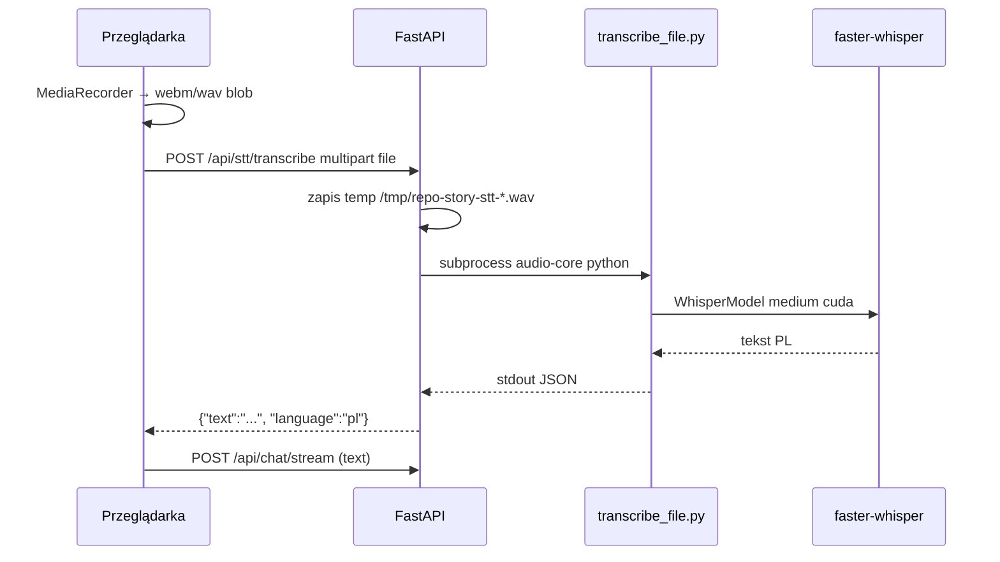

# Instrukcja wdrożenia: Repo Opowieść — asystent na żywo (Fazy 1–3)

**Wersja dokumentu:** 2026-05-18 (zaktualizowano po sesji wdrożeniowej)  
**Status Faz 1–3:** **UKOŃCZONE** (tag `v4.3.0-voice-assistant`, commit `687c8f6`)  
**Następne kroki (Fazy A i B):** [`AGENT_IMPLEMENTATION_PHASE_AB.md`](./AGENT_IMPLEMENTATION_PHASE_AB.md)  
**Projekt:** `/mnt/ollama/projekty/repo-story` (Repo Opowieść)  
**Port:** `9743` (domyślnie, `./run.sh`)  
**Powiązany projekt (bez zmian):** `/mnt/ollama/projekty/repo-analyzer` port `9742`  
**Cel użytkownika (osiągnięty w v4.3):** rozmowa głosowa — mówię (🎤) → odpowiedź tekst na żywo (stream) → słyszę (TTS).  
**Kolejność historyczna:** Faza 1 → 2 → 3 (każda **rozszerza** poprzednią). Kolejność **przyszła:** A → B (patrz dokument PHASE_AB).

---

## 0. Repozytoria GitHub i wersjonowanie

### 0.0 Dwa osobne projekty (nie mieszać)

| Projekt | Ścieżka lokalna | GitHub | Port | Rola |
|---------|-----------------|--------|------|------|
| **Repo Analyzer** | `/mnt/ollama/projekty/repo-analyzer` | https://github.com/Noacodenoobe/repo-analyzer | 9742 | Raport techniczny, RAG kodu |
| **Repo Opowieść** | `/mnt/ollama/projekty/repo-story` | https://github.com/Noacodenoobe/repo-story | 9743 | Przewodnik edukacyjny, czat RAG, profil systemu |

**Zasada:** zmiany w asystencie na żywo (Fazy 1–3) dotyczą **wyłącznie `repo-story`**, chyba że użytkownik wyraźnie poprosi o sync z `repo-analyzer`.

### 0.0.1 Weryfikacja wersji na GitHub (OBOWIĄZKOWE przy wątpliwościach)

Przed rozpoczęciem pracy agent powinien sprawdzić, czy lokalny kod odpowiada zdalnemu:

```bash
cd /mnt/ollama/projekty/repo-story
git fetch origin
git status -sb
git log origin/main -5 --oneline
git diff origin/main --stat
```

Dla `repo-analyzer` (tylko porównanie, bez zmian):

```bash
cd /mnt/ollama/projekty/repo-analyzer
git fetch origin && git status -sb && git log origin/main -3 --oneline
```

**Historia commitów (orientacyjnie):**

| Commit / wersja | repo-story | Zawartość |
|-----------------|------------|-----------|
| `5eb2da8` | początek | MVP slajdy zero-tech |
| `253763c` / `v4.0.0` | EducationPack, RAG SQLite, czat, profil, HTML export, regulamin w KB |
| `687c8f6` / `v4.3.0-voice-assistant` | SSE stream, STT, TTS Piper, UX głosu, testy, dictation script |
| Fazy A–B | plan | Supertonic, notatnik, akcje z potwierdzeniem — patrz `AGENT_IMPLEMENTATION_PHASE_AB.md` |

Jeśli `git status` pokazuje wiele niezacommitowanych plików — **najpierw** uzgodnij z użytkownikiem commit/push, potem nowe funkcje.

### 0.0.2 Konieczność push na GitHub po zakończeniu sprintu

Po każdej ukończonej fazie (lub większym module) agent **musi**:

1. Upewnić się, że `.gitignore` wyklucza dane runtime (`data/knowledge.db`, `reports/*.json`, `reports/exports/`).
2. `git add` tylko kod, prompty, `docs/`, `scripts/` — **nie** commitować sekretów (`.env`).
3. Commit z jasnym komunikatem (np. `feat(chat): SSE streaming for RAG assistant (phase 1)`).
4. `git push origin main` (wymaga `gh` / dostępu do `Noacodenoobe`).
5. Zweryfikować: `gh repo view Noacodenoobe/repo-story` oraz ostatni commit na GitHub w przeglądarce.

```bash
cd /mnt/ollama/projekty/repo-story
git status
git add -A   # respektuje .gitignore
git commit -m "$(cat <<'EOF'
Krótki opis zmiany (po polsku lub angielsku, spójnie z repo).

EOF
)"
git push origin main
```

**Nie pushować:** `data/knowledge.db`, `reports/`, logów, `.venv/`.

Jeśli push się nie powiedzie — raportuj użytkownikowi (brak tokenu, konflikt); **nie** rób `git push --force` na `main` bez zgody.

### 0.0.3 Tagi wersji (opcjonalnie, zalecane po Fazie 1/2/3)

```bash
git tag -a v4.0.0 -m "Education pack, RAG chat, system profile, HTML export"
git push origin v4.0.0
# po Fazie 3: v4.3.0-voice-assistant (faktyczny tag na GitHub)
# po Fazie A: v4.4.0-assistant-a (plan)
# po Fazie B: v4.5.0-assistant-b (plan)
```

---

## 0.1 Dla agenta w nowej sesji — przeczytaj najpierw

**Jeśli wdrażasz coś NOWEGO** — czytaj najpierw ten plik (kontekst), potem **[`AGENT_IMPLEMENTATION_PHASE_AB.md`](./AGENT_IMPLEMENTATION_PHASE_AB.md)** (zadania).

### 0.2 Co już istnieje (v4.3 — NIE psuj tego)

| Obszar | Stan | Kluczowe pliki |
|--------|------|----------------|
| Przewodniki edukacyjne | Działa | `education_generator.py`, `education_pack.py` |
| Polski (PL-gate) | Działa | `polish_validator.py` |
| Eksport HTML | Działa | `html_exporter.py`, `GET /api/reports/{id}/export.html` |
| SQLite RAG | Działa | `knowledge_store.py`, `data/knowledge.db` |
| Czat sync (fallback) | Działa | `POST /api/chat` |
| Czat streaming SSE | Działa | `POST /api/chat/stream`, `sse.py`, `rag_chat.chat_stream()` |
| Multi-turn + voice_mode | Działa | `CHAT_HISTORY_LIMIT`, `conversation_config.py` |
| STT mikrofon | Działa | `POST /api/stt/transcribe`, `stt_service.py`, `stt_quality.py` |
| TTS Piper | Działa | `POST /api/tts/speak`, `tts_service.py` |
| Profil systemu + rules | Działa | `system_profile.py`, `host_rules.py` |
| Dyktowanie systemowe | Działa | `scripts/system-dictation.sh` |
| Testy jednostkowe | Działa | `tests/test_*` (13 testów przy ostatnim push) |
| Frontend czat | Działa | `index.html`, `app.js`, `styles.css` — toggle 🎤, TTS bar |

### 0.3 Czego NIE ma (Fazy A i B — następna sesja)

Fazy 1–3 są **zamknięte**. Kolejna praca: **[`AGENT_IMPLEMENTATION_PHASE_AB.md`](./AGENT_IMPLEMENTATION_PHASE_AB.md)**.

Skrót planu A+B (zatwierdzony przez użytkownika):

| Faza | Moduły |
|------|--------|
| **A** | Supertonic TTS, notatnik użytkownika w RAG, UI sesji, alerty pustej bazy |
| **B** | Wykonaj krok (whitelist), katalog projektów, checklisty, cron profilu |

### 0.6 Kronika sesji wdrożeniowej (2026-05-18) — co zrobiono

| Etap | Opis |
|------|------|
| Kontekst | Rozwinięcie `repo-analyzer` → `repo-story` (edukacja + RAG v4.0) |
| Faza 1 | `chat_stream()`, SSE, parser w `app.js`, testy `test_rag_chat_stream.py` |
| Faza 2 | `transcribe_file.py`, `stt_service.py`, ffmpeg, mikrofon MediaRecorder |
| Faza 3 | `tts_service.py` (Piper), checkbox głosu, `playTtsForText` |
| UX iteracje | Toggle mikrofonu (nie hold); filtr halucynacji STT (Amara.org); pasek 🗣️ Stop/Ponów; auto-TTS po 🎤; odblokowanie audio w przeglądarce |
| System | `system-dictation.sh` — STT + wklejenie tekstu (skrót klawiszowy) |
| GitHub | `687c8f6` + tag `v4.3.0-voice-assistant` |
| Decyzja użytkownika | Priorytet następny: **Poziom A + B** (dokument PHASE_AB) |

**Problemy napotkane i rozwiązania:**

| Problem | Rozwiązanie |
|---------|-------------|
| CUDA `libcublas` w subprocess STT | Fallback CPU w `transcribe_file.py` |
| Halucynacja Whisper na ciszy | `stt_quality.py` + VAD w Whisper |
| Brak TTS przy wyłączonym checkbox | Auto-TTS po mikrofonie; checkbox domyślnie ON |
| Autoplay blocked w przeglądarce | `unlockAudioPlayback()` + komunikat „kliknij 🔊 Odtwórz” |
| `python-multipart` | Dodane do `requirements.txt` |

### 0.4 Zasady hosta (OBOWIĄZKOWE przy implementacji)

Źródła kanoniczne (już indeksowane do RAG, **czytaj przed instalacją pakietów**):

- `/mnt/ollama/system-control/info wazne/regulamin_linux_ai.md`
- `/mnt/ollama/system-control/info wazne/standard_projektu_ai_na_tym_komputerze.md`

Skrót dla agenta:

1. Ciężkie AI tylko na `/mnt/ollama`, nie na `/`.
2. **Nie** `pipx install whisperx` / torch — tylko dedykowane `.venv` (np. `audio-core`).
3. `repo-story` ma własne `.venv` w projekcie — **nie instaluj** tam `faster-whisper` / `torch` bez wyraźnej decyzji i zgodności z regulaminem; preferuj **subprocess** do `audio-core` venv.
4. Ollama: `OLLAMA_HOST` domyślnie `http://localhost:11434`; modele użytkownika mogą być na dysku zewnętrznym (`OLLAMA_MODELS` w profilu).

### 0.5 Środowisko użytkownika (zweryfikowane 2026-05-18)

| Element | Wartość |
|---------|---------|
| OS | Ubuntu 24.04.4 LTS, kernel 6.17 |
| GPU | NVIDIA RTX 5080 Laptop, ~16 GB VRAM, driver 580.x |
| Audio | PipeWire (`pw-cli`, **brak** `pactl`) |
| Ollama | 0.21.0, Bielik: `SpeakLeash/bielik-11b-v3.0-instruct:Q4_K_M` |
| Embed | `nomic-embed-text:latest` (RAG) |
| faster-whisper | v1.2.1 w `/mnt/ollama/ai-envs/audio-core/.venv` |
| Modele STT | `base`, `medium` w `/mnt/ollama/whisper_models` (Systran HF cache) |
| Test ładowania modelu | `WhisperModel('medium', device='cuda', compute_type='float16')` — **OK** |
| openai-whisper CLI | `~/.local/bin/whisper` — **osobny** stack, nie używać jako głównego |

---

## 1. Architektura docelowa



### 1.1 Zależność faz (dlaczego kolejność 1 → 2 → 3)

| Faza | Wymaga | Niezależna od |
|------|--------|--------------|
| **1 Streaming tekstu** | Istniejący RAG + `stream_generate` | Fazy 2 i 3 |
| **2 Mikrofon STT** | Działający czat (lepiej ze streamem z Fazy 1) | Fazy 3 |
| **3 TTS głos** | Stabilny tekst wejścia (Faza 2) i wyjścia (Faza 1) | — |

Faza 3 **nie jest** trywialnym dodatkiem — wymaga TTS po polsku, kolejki GPU i UX (echo, przerwanie mowy).

---

## 2. Faza 1 — Streaming odpowiedzi tekstowej

### 2.1 Cel produktowy

Użytkownik pisze pytanie → odpowiedź **pojawia się fragmentami** (jak ChatGPT), nie po 15–30 s jednym blokiem.

### 2.2 Stan wyjściowy w kodzie

`backend/app/llm_client.py` — metoda **`stream_generate()`** już implementuje Ollama `/api/generate` z `stream: true` i `yield chunk`.

`backend/app/rag_chat.py` — używa tylko **`generate()`** (sync).

### 2.3 Projekt techniczny (rekomendowany)

**Transport:** **SSE (Server-Sent Events)** zamiast WebSocket.

- Prostsze w FastAPI (`StreamingResponse`).
- Jednokierunkowy strumień (serwer → klient) wystarczy.
- Mniej stanu sesji po stronie serwera.

**Nowe API:**

```
POST /api/chat/stream
Content-Type: application/json
Body: { "message": "...", "session_id": "optional-uuid" }

Response: text/event-stream
Events:
  event: meta
  data: {"session_id":"...","citations":[...]}

  event: token
  data: {"text":"słowo"}

  event: done
  data: {"full_answer":"..."}

  event: error
  data: {"detail":"..."}
```

**Logika (nowy moduł lub rozszerzenie `rag_chat.py`):**

1. Skopiuj retrieval z `RagChatService.chat()` (embed → `search_chunks` → citations) — **przed** generowaniem wyślij event `meta` z citations.
2. Zbuduj ten sam `prompt` i `system` co w `chat()`.
3. Zamiast `generate()`, użyj `stream_generate()` i yield każdy chunk jako `event: token`.
4. Po zakończeniu: zapisz pełną odpowiedź do `chat_messages` (jak dziś).
5. **Opcjonalnie:** dołącz ostatnie N wiadomości z `get_chat_history(session_id)` do promptu (multi-turn) — v4.0 tego **nie robi**; można dodać w Fazie 1 jako ulepszenie.

**Pliki do utworzenia/zmiany:**

| Plik | Akcja |
|------|--------|
| `backend/app/rag_chat.py` | Dodać `chat_stream()` generator |
| `backend/app/main.py` | Endpoint `POST /api/chat/stream`, `StreamingResponse` |
| `frontend/public/js/app.js` | `fetch` + `ReadableStream` lub `EventSource` (jeśli GET) |
| `frontend/public/css/styles.css` | Styl kursora / animacja podczas streamu |

**Uwaga implementacyjna:** `EventSource` w przeglądarce obsługuje tylko **GET**. Dla POST + body użyj `fetch()` z `response.body.getReader()` i parsowaniem linii `data: {...}`.

### 2.4 Weryfikacja Fazy 1

| # | Test | Oczekiwany wynik |
|---|------|------------------|
| 1.1 | `curl -s http://127.0.0.1:9743/api/health` | `"ollama": true` |
| 1.2 | `curl -N -X POST http://127.0.0.1:9743/api/chat/stream -H 'Content-Type: application/json' -d '{"message":"Co to NoiseTorch?"}'` | Wieloliniowa odpowiedź SSE, eventy `token` |
| 1.3 | UI zakładka Rozmowa | Tekst rośnie na żywo, na końcu cytowania |
| 1.4 | `logs/server.log` | Brak traceback; czas do pierwszego tokena < 30 s |
| 1.5 | Po streamie: ponowne pytanie z tym samym `session_id` | (jeśli multi-turn) kontekst rozmowy |

**Kryterium akceptacji:** użytkownik widzi pierwsze słowa odpowiedzi w < 10 s od wysłania (przy działającej Ollama), bez czekania na cały akapit.

### 2.5 Typowe problemy Fazy 1

| Problem | Przyczyna | Rozwiązanie |
|---------|-----------|-------------|
| Brak tokenów, tylko `done` | Bielik nie streamuje / zły parser JSON linii | Logować surowe linie z Ollama; sprawdzić `stream: true` |
| CORS / buforowanie | Proxy buforuje SSE | Nagłówki: `Cache-Control: no-cache`, `X-Accel-Buffering: no` |
| Timeout 300 s | `OLLAMA_TIMEOUT` | OK dla długich odpowiedzi; UI pokazuje „myślę…” |
| Puste citations | Brak chunków w DB | `POST /api/knowledge/migrate`, `POST /api/system-profile/refresh` |

---

## 3. Faza 2 — Mikrofon (toggle) + STT — **WDROŻONE**

### 3.1 Cel produktowy

Przycisk **🎤** — **klik start / klik stop** → transkrypcja → automatycznie `POST /api/chat/stream` (z TTS jeśli włączone).

### 3.2 Dlaczego NIE wbudowywać faster-whisper w `.venv` repo-story (domyślnie)

Zgodnie z regulaminem użytkownika:

- `torch` + `faster-whisper` = ciężkie zależności → osobne venv na `/mnt/ollama/ai-envs/`.
- Instalacja w `repo-story/.venv` **duplikuje** ~GB i ryzykuje konflikt CUDA.

**Rekomendowany wzorzec:** subprocess do istniejącego Pythona:

```text
/mnt/ollama/ai-envs/audio-core/.venv/bin/python
```

z małym skryptem pomocniczym w `repo-story/scripts/transcribe_file.py` (do utworzenia).

### 3.3 Projekt techniczny STT

**Przepływ:**



**Nowe API:**

```
POST /api/stt/transcribe
Content-Type: multipart/form-data
Field: audio (file, max np. 25 MB, max duration 120 s)

Response JSON:
{
  "text": "transkrypcja",
  "language": "pl",
  "duration_s": 12.3,
  "model": "medium"
}
```

**Nowy moduł:** `backend/app/stt_service.py`

- Stałe ścieżki z `config.py` (patrz sekcja 4).
- `subprocess.run([AUDIO_CORE_PYTHON, TRANSCRIBE_SCRIPT, wav_path], timeout=120, capture_output=True)`.
- Parsuj stdout jako JSON; przy błędzie zwróć HTTP 503 z komunikatem PL.

**Skrypt:** `scripts/transcribe_file.py`

```python
# argv[1] = path to wav
# env: HF_HOME=/mnt/ollama/whisper_models
# print(json.dumps({"text": "...", "language": "pl"}))
```

Parametry faster-whisper (zgodne z testem na maszynie użytkownika):

- `model_size`: `medium` (config: `STT_MODEL=medium`; `base` jako fallback przy OOM)
- `device`: `cuda`
- `compute_type`: `float16`
- `language`: `pl`
- `download_root`: `/mnt/ollama/whisper_models`

**Frontend (`app.js`):**

1. `navigator.mediaDevices.getUserMedia({ audio: true })` — wymaga HTTPS lub `localhost`.
2. `MediaRecorder` → po `stop()` blob → `FormData` → `POST /api/stt/transcribe`.
3. Wstaw zwrócony `text` do `#chat-input` lub wyślij od razu do `/api/chat/stream`.
4. UI: stany `idle | recording | transcribing | error`.
5. PipeWire: jeśli brak dźwięku, komunikat „sprawdź mikrofon w ustawieniach systemu”.

**Pliki:**

| Plik | Akcja |
|------|--------|
| `backend/app/config.py` | `AUDIO_CORE_VENV`, `STT_MODEL`, `STT_MAX_BYTES` |
| `backend/app/stt_service.py` | nowy |
| `scripts/transcribe_file.py` | nowy |
| `backend/app/main.py` | endpoint STT |
| `frontend/public/index.html` | przycisk mikrofonu w `#tab-chat` |
| `frontend/public/js/app.js` | logika MediaRecorder |
| `frontend/public/css/styles.css` | stan nagrywania (pulsujący przycisk) |

### 3.4 Kolejka GPU (krytyczne)

**Nie uruchamiaj równolegle:** Bielik (Ollama) + faster-whisper na GPU.

Sekwencja:

1. STT kończy → zwolnij model (proces subprocess się kończy).
2. Dopiero potem start `chat/stream` (Ollama).

W przeciwnym razie: OOM na 16 GB VRAM (Bielik ~6–8 GB + whisper medium ~2–3 GB + overhead).

### 3.5 Weryfikacja Fazy 2

| # | Test | Oczekiwany wynik |
|---|------|------------------|
| 2.1 | Nagraj plik testowy WAV 5 s po polsku, wywołaj skrypt ręcznie | JSON z sensownym tekstem |
| 2.2 | `curl -F "audio=@test.wav" http://127.0.0.1:9743/api/stt/transcribe` | HTTP 200, pole `text` |
| 2.3 | UI: nagranie 10 s pytania o NoiseTorch | Tekst polski w polu lub stream odpowiedzi |
| 2.4 | `nvidia-smi` podczas STT | Proces Python audio-core używa GPU |
| 2.5 | Zaraz po STT — stream chat | Brak CUDA OOM |
| 2.6 | Profil w RAG zawiera `whisper` | Po `POST /api/system-profile/refresh` |

**Kryterium akceptacji:** użytkownik bez klawiatury zadaje jedno pytanie głosowe i dostaje odpowiedź tekstową (stream).

### 3.6 Typowe problemy Fazy 2

| Problem | Rozwiązanie |
|---------|-------------|
| Brak uprawnień mikrofonu | Przeglądarka → pozwolenie; tylko localhost/HTTPS |
| Pusty transkrypt | Sprawdź format audio (konwersja do 16 kHz mono WAV przez `ffmpeg` w API) |
| `ffmpeg` missing | `sudo apt install ffmpeg` (apt, zgodnie z regulaminem) |
| CUDA OOM | Użyj `base` lub `int8` compute_type |
| Subprocess timeout | Zwiększ timeout; skróć max nagranie |

**Konwersja audio w API (zalecane):**

```bash
ffmpeg -y -i input.webm -ar 16000 -ac 1 output.wav
```

Wywołanie z `stt_service.py` przed transcribe.

---

## 4. Faza 3 — TTS (odpowiedź głosowa) — **WDROŻONE**

### 4.1 Cel

Po zakończeniu streamu użytkownik **słyszy** odpowiedź (Piper); może **zatrzymać** lub **ponowić**.

### 4.2 Opcje TTS (analiza pod Linux + regulamin)

| Opcja | Jakość PL | Offline | Zgodność z regulaminem | Uwagi |
|-------|-----------|---------|----------------------|--------|
| **Piper** | Dobra | Tak | venv na `/mnt/ollama/ai-envs/tts` | Rekomendowane; lekkie |
| **edge-tts** | Bardzo dobra | Nie (MS) | lekkie pip w venv | Wymaga sieci |
| **Coqui TTS** | Dobra | Tak | ciężkie | Raczej osobne venv |
| **Ollama bez TTS** | — | — | — | Bielik nie generuje audio |

**Wdrożenie:** Piper przez subprocess (`PIPER_BIN`, model `pl_PL-gosia-medium.onnx` w `/mnt/ollama/modele/piper/`). Supertonic — plan w Fazie **A1** (PHASE_AB).

### 4.3 API (zaimplementowane)

```
POST /api/tts/speak
Body: { "text": "...", "voice": "pl" }
Response: audio/wav (plik tymczasowy, usuwany po wysłaniu)
```

Body czatu/stream: `{ "message", "session_id?", "voice_mode": true }` — krótsze odpowiedzi (`conversation_config.py`).

### 4.4 Weryfikacja Fazy 3

- [x] Piper generuje WAV (`curl` → `/tmp/tts.wav`)
- [x] Endpoint HTTP 200
- [x] UI: checkbox, pasek 🗣️, 🔊 Odtwórz / ⏹ przy wiadomości
- [x] Auto-TTS po mikrofonie; komunikat przy blokadzie autoplay

---

## 5. Konfiguracja — zmienne w `config.py` (stan v4.3)

```python
# STT
AUDIO_CORE_PYTHON, TRANSCRIBE_SCRIPT, WHISPER_MODELS_DIR
STT_MODEL, STT_FALLBACK_MODEL, STT_MAX_AUDIO_MB, STT_TIMEOUT_S
STT_MIN_DURATION_S, STT_MIN_RMS

# TTS (Piper)
PIPER_BIN, PIPER_MODEL, TTS_MAX_CHARS, TTS_TIMEOUT_S

# Rozmowa
CHAT_HISTORY_LIMIT, CHAT_CONVERSATION_MODE  # balanced | voice | detailed
```

---

## 6. Mapa plików repozytorium (stan v4.3)

```text
/mnt/ollama/projekty/repo-story/
├── backend/app/
│   ├── main.py
│   ├── rag_chat.py
│   ├── sse.py
│   ├── stt_service.py
│   ├── stt_quality.py
│   ├── tts_service.py
│   ├── conversation_config.py
│   ├── knowledge_store.py
│   ├── host_rules.py
│   └── ...
├── scripts/
│   ├── transcribe_file.py
│   ├── system-dictation.sh
│   ├── collect_system_profile.py
│   └── collect-system-profile.sh
├── tests/
│   ├── test_rag_chat_stream.py
│   ├── test_stt_service.py
│   ├── test_stt_quality.py
│   └── test_tts_service.py
├── frontend/public/
│   ├── index.html
│   ├── js/app.js
│   └── css/styles.css
├── docs/
│   ├── AGENT_IMPLEMENTATION_LIVE_ASSISTANT.md   # ten plik
│   ├── AGENT_IMPLEMENTATION_PHASE_AB.md         # Fazy A i B
│   └── system-profile-cron.md
├── data/knowledge.db          # runtime — nie w git
└── run.sh
```

---

## 7. Endpointy API — pełna lista (v4.0)

| Metoda | Ścieżka | Opis |
|--------|---------|------|
| GET | `/api/health` | Ollama + modele |
| POST | `/api/analyze` | Generuj przewodnik |
| POST | `/api/chat` | Czat sync (zostaw dla kompatybilności) |
| **POST** | **`/api/chat/stream`** | **Faza 1 — SSE streaming** |
| **POST** | **`/api/stt/transcribe`** | **Faza 2 — mikrofon STT** |
| **POST** | **`/api/tts/speak`** | **TTS Piper (WAV)** |
| — | `voice_mode` w body `/api/chat` i `/api/chat/stream` | Krótsze odpowiedzi pod głos |
| POST | `/api/system-profile/refresh` | Profil + rules index |
| GET | `/api/knowledge/stats` | Statystyki chunków |
| POST | `/api/knowledge/migrate` | Indeksuj reports/*.json |
| POST | `/api/knowledge/index-host-rules` | Indeksuj regulamin |

---

## 8. Plan prac agenta (kolejność commitów logicznych)

### Sprint A — Faza 1 (szac. 1 sesja)

1. [x] `rag_chat.chat_stream()` + test jednostkowy mock Ollama (`tests/test_rag_chat_stream.py`)
2. [x] `main.py` endpoint SSE + nagłówki anti-buffer
3. [x] `app.js` — parser stream + UI
4. [x] Weryfikacja 1.1–1.2 (curl SSE); 1.3 UI — sprawdź w przeglądarce
5. [x] Nie usuwaj `POST /api/chat` (fallback)

### Sprint B — Faza 2 (szac. 1–2 sesje)

1. [x] `scripts/transcribe_file.py` + test ręczny WAV
2. [x] `stt_service.py` + ffmpeg convert
3. [x] `main.py` endpoint multipart (`python-multipart` w requirements)
4. [x] UI mikrofon (toggle klik) + integracja ze stream czatem + `stt_quality.py`
5. [x] Weryfikacja 2.2 (curl); 2.3–2.5 — sprawdź mikrofon w przeglądarce
6. [x] Profil whisper — już w `collect_system_profile.py`

### Sprint C — Faza 3 — **UKOŃCZONE**

1. [x] Piper (`~/.local/bin/piper` + modele w `/mnt/ollama/modele/piper/`)
2. [x] `tts_service.py` + `POST /api/tts/speak`
3. [x] UI: checkbox, pasek TTS, 🔊/⏹ przy odpowiedziach
4. [x] Weryfikacja 4.4 + UX po feedbacku użytkownika

### Sprint D — Fazy A i B (następna sesja)

Patrz **[`AGENT_IMPLEMENTATION_PHASE_AB.md`](./AGENT_IMPLEMENTATION_PHASE_AB.md)**.

---

## 9. Uruchomienie i smoke test (każda sesja agenta)

```bash
cd /mnt/ollama/projekty/repo-story
source .venv/bin/activate
pip install -r requirements.txt   # python-multipart wymagane dla STT upload
python -m unittest discover -s tests -p 'test_*.py' -v
./run.sh

# Terminal 2
curl -s http://127.0.0.1:9743/api/health | python3 -m json.tool
curl -s http://127.0.0.1:9743/api/knowledge/stats | python3 -m json.tool
curl -s -X POST http://127.0.0.1:9743/api/system-profile/refresh | python3 -m json.tool
```

Otwórz: `http://127.0.0.1:9743/` → zakładka **Rozmowa**.

---

## 10. Odniesienia dokumentacji zewnętrznej

| Narzędzie | Dokumentacja | Użycie w projekcie |
|-----------|--------------|-------------------|
| Ollama API | https://github.com/ollama/ollama/blob/main/docs/api.md | `generate`, `stream`, `embeddings` |
| FastAPI StreamingResponse | https://fastapi.tiangolo.com/advanced/custom-response/#streamingresponse | SSE Faza 1 |
| faster-whisper | https://github.com/SYSTRAN/faster-whisper | STT Faza 2 |
| MDN MediaRecorder | https://developer.mozilla.org/en-US/docs/Web/API/MediaRecorder | UI Faza 2 |
| Piper | https://github.com/rhasspy/piper | TTS Faza 3 |

---

## 11. Czego agent NIE powinien robić

- [ ] Modyfikować `/mnt/ollama/projekty/repo-analyzer` (9742) bez wyraźnego polecenia.
- [ ] `pip install torch` w `repo-story/.venv` bez uzasadnienia.
- [ ] Usuwać istniejące endpointy v4.0.
- [ ] Commitować `data/knowledge.db` lub `reports/*.json` (dane lokalne).
- [ ] Wdrażać Fazę B1 (shell) bez whitelisty i bez potwierdzenia UI.
- [ ] Duplikować torch/faster-whisper w `repo-story/.venv`.

---

## 12. Prompty startowe dla nowej sesji

### 12.1 Utrzymanie / bugfix (Fazy 1–3 już są)

```text
Repo Opowieść v4.3 — naprawa/utrzymanie asystenta głosowego.
Przeczytaj: docs/AGENT_IMPLEMENTATION_LIVE_ASSISTANT.md (sekcje 0.2, 0.6, 2–4).
Git: git fetch && git status -sb. Tag: v4.3.0-voice-assistant.
Port 9743. Nie ruszaj repo-analyzer (9742).
```

### 12.2 Nowe funkcje — Fazy A i B (DOMYŚLNY dla kolejnej sesji)

```text
Wdrażasz Repo Opowieść — Fazy A i B.

Przeczytaj OBOWIĄZKOWO (kolejność):
1. /mnt/ollama/projekty/repo-story/docs/AGENT_IMPLEMENTATION_LIVE_ASSISTANT.md
2. /mnt/ollama/projekty/repo-story/docs/AGENT_IMPLEMENTATION_PHASE_AB.md
3. /mnt/ollama/system-control/info wazne/regulamin_linux_ai.md

git fetch origin && git status -sb && git log origin/main -3 --oneline
GitHub: https://github.com/Noacodenoobe/repo-story
Sprint A: A2 notatnik → A4 alerty → A3 sesja → A1 Supertonic
Sprint B: B1 wykonaj krok → B2 projekty → B3 checklisty → B4 cron
Po sprincie: testy + commit + push (sekcja 0.0.2).
```

---

## 13. Historia decyzji projektowych

- **v4.0** — RAG globalny, przewodniki, profil, regulamin w KB.
- **v4.3** — streaming + STT + TTS + UX głosu; asystent **doradza**, nie wykonuje poleceń.
- **Whisper** — subprocess `audio-core`, nie pip w repo-story.
- **TTS** — Piper lokalny; Supertonic zaplanowany w A1.
- **Mikrofon** — toggle (nie hold); auto-TTS po 🎤.
- **Następny krok** — Fazy A+B: lepszy głos, notatnik, bezpieczne „Wykonaj krok”.

---

## 14. Dokumentacja powiązana

| Plik | Zawartość |
|------|-----------|
| [`AGENT_IMPLEMENTATION_PHASE_AB.md`](./AGENT_IMPLEMENTATION_PHASE_AB.md) | Szczegółowa specyfikacja i checklisty Faz A i B |
| [`system-profile-cron.md`](./system-profile-cron.md) | Cron odświeżania profilu (B4) |
| [`README.md`](../README.md) | Krótki opis użytkownika + link do GitHub |

---

*Koniec dokumentu Faz 1–3. Kontynuacja: `AGENT_IMPLEMENTATION_PHASE_AB.md`.*
